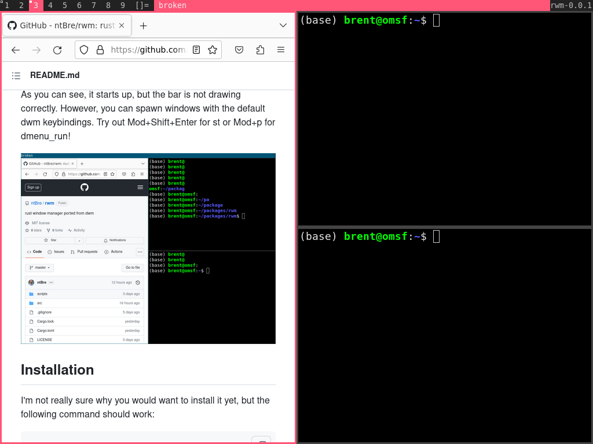

[](https://github.com/ntBre/rwm/actions/workflows/check.yml)
[](https://github.com/ntBre/rwm/actions/workflows/test.yml)

# rwm
rust window manager ported from [dwm](https://dwm.suckless.org/)

For now this is (nearly) a line-for-line port of dwm 6.4 with tons of unsafe
code. Once it's working in this state, I'll start moving toward a safe Rust
version where possible. Linked lists are pretty cool, though.

## Screenshot
As you can see, it starts up, and the bar is drawing correctly! You can spawn
windows with the default dwm keybindings. Try out Mod+Shift+Enter for st or
Mod+p for dmenu_run!



## Installation
I'm not really sure why you would want to install it yet, but the following
command should work:

``` shell
make install
```

I've been building with a Rust 1.75.0 nightly compiler from 2023-10-10, but
hopefully it will work on other nightly versions. I use the `vec_from_raw_parts`
and `lazy_cell` features from nightly, so you will need nightly.

You'll also need the X11, Xft, and Xinerama libraries installed on your system
where rustc can find them. See the `build.rs` file if you need to include full
paths.

Finally, if you're installing an experimental window manager based on dwm and
written in Rust, it's probably safe to assume you know how to start a window
manager. But just to be safe, I recommend putting something like the following
in your `$HOME/.xinitrc` script and launching with `startx`:

``` shell
exec rwm
```

I usually wrap my dwm in a `while true` loop to allow smooth restarting, but
that spawned endless instances of rwm when I tried it earlier. I also usually
redirect output to a log file, but to simplify things, rwm calls `dup2` to
redirect its own output to `$HOME/rwm.out` and `$HOME/rwm.err` by default.

You can set the log level with the `RUST_LOG` environment variable. I've been
running `RUST_LOG=debug RUST_BACKTRACE=1 startx` in my testing and tailing the
err file over ssh.

If you use a display manager, you can also include an `rwm.desktop` file
wherever your distro keeps those (maybe `/usr/share/xsessions/`?) that looks
like the one below. I've had success with this approach on an Ubuntu VM.

``` shell
[Desktop Entry]
Encoding=UTF-8
Name=Rwm
Comment=Rust window manager
Exec=rwm
Icon=rwm
Type=XSession
```

